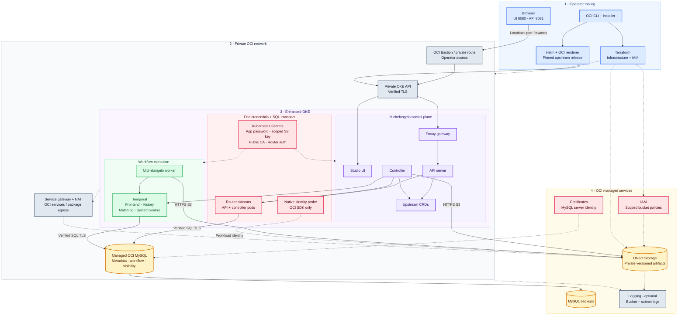

# Michelangelo on Oracle Cloud Infrastructure

Deploy [Michelangelo AI](https://github.com/michelangelo-ai/michelangelo) in your OCI tenancy with Terraform, Helm and one central configuration file. This wrapper consumes an immutable upstream release and adapts its deployment manifests without changing upstream source.


## What this wrapper includes

| Layer | Included |
| --- | --- |
| Infrastructure | Dedicated private VCN/subnets/NSGs, Enhanced OKE, a small worker pool, private managed OCI MySQL, private versioned Object Storage bucket |
| Platform | Pinned Michelangelo UI, Envoy API gateway, API server, controller and workflow worker; bundled Temporal frontend/history/matching/system-worker services |
| Installer | Central JSON configuration, source/chart/image verification, deterministic rendering, reviewed plan/manifest hashes, target confirmation and mutation guards |
| Database | Schema-scoped application user, temporary bootstrap Job, verified TLS Router sidecars for API/controller, direct verified SQL TLS for Temporal |
| Identity | Operator OCI profile, exact cluster/namespace/service-account workload policy, dedicated bucket-scoped S3 key compatibility exception |
| Kubernetes integration | Checksum-pinned upstream CRDs, constrained controller RBAC, OCI-compatible image references and non-root UI configuration |
| Operations | Temporary Bastion access, optional bucket service/subnet flow logs, MySQL backups, guarded dev shutdown that retains artifacts |
| Examples and checks | Tiny regression workflow, artifact/model lineage checks, native workload identity allow/deny probes, transport tests and GitHub CI |

The default dev baseline is **one E4 Flex worker with 2 OCPUs / 16 GiB**, **MySQL.2 with 100 GiB storage**, and no GPU or distributed training cluster. The running estimate is **about $187/month**, plus backups, artifacts, logs and usage. [Sizing and costs](docs/sizing-and-cost.md) explain assumptions, scale options and retained-resource charges.

## Architecture




**Colors:** blue - operator tooling; purple - control plane; green - workflows; amber - data; rose - credentials and identity; slate - networking and optional observability.

The browser accesses UI and API through two local port forwards over the private API tunnel; no public ingress or load balancer is deployed. Object Storage, IAM, Certificates, backups and Logging are OCI services, not pods. Secrets mount into the relevant application and schema-setup containers. The dashed native path is an OCI SDK diagnostic; upstream artifacts use the scoped S3 compatibility key. See [architecture details](docs/architecture.md) and [security boundaries](docs/security.md).

## Deploy in your tenancy

Follow the ordered [deployment guide](docs/deployment.md) for prerequisites, configuration, certificates, identity, infrastructure, database bootstrap and installation. The example configuration contains placeholders and intentionally cannot deploy as supplied.

1. Clone this repository and copy `config/config.example.json` to ignored `config/config.json`.
2. Configure your dedicated compartment, region, OKE image/AD, networking, MySQL certificate and scoped artifact identity. For private operator access, enable Bastion and allow your current public IP as `/32`.
3. Install the renderer dependencies in an isolated Python environment, fetch the pinned upstream chart, then validate configuration/tools.
4. Generate and privately review the Terraform plan. Apply its exact SHA256 to the configured compartment with explicit paid-resource authorization.
5. Establish the private OKE tunnel, refresh endpoint/context settings, bootstrap the application schemas and supply the four Kubernetes Secrets.
6. Render and review the final manifests, install their exact SHA256, then run smoke, artifact and pipeline checks.

Core commands, **after completing the prerequisite steps in the guide**:

```text
python scripts/installer.py config validate
python scripts/installer.py fetch
python scripts/installer.py doctor
python scripts/installer.py terraform plan --allow-cloud-read --ack-sensitive-local-artifacts
terraform -chdir=terraform show ../.generated/deployment.tfplan
python scripts/installer.py terraform apply --allow-paid-resources --ack-sensitive-local-artifacts --confirm-target <compartment-ocid> --reviewed-plan-sha256 <plan-sha256>
python scripts/installer.py render --manifests
python scripts/installer.py install --sync-secrets --allow-cluster-mutation --confirm-target <kube-context> --reviewed-manifest-sha256 <manifest-sha256>
python scripts/installer.py smoke
```

Commands default to `config/config.json`. Passwords and keys belong in protected runtime inputs, not JSON or command arguments. Configuration changes invalidate review receipts; refresh settings **before** rendering the artifact you intend to install. The installer does not automatically create your compartment, service user/key or production certificate authority.

## Private operator access

After deployment and installation, run `python tools/connect_bastion.py --create-session`, keep its printed SSH command running, and use its isolated kubeconfig. In **two additional terminals**, using the example release/namespace:

```text
kubectl --kubeconfig .local/bastion/kubeconfig -n michelangelo port-forward --address 127.0.0.1 service/michelangelo-ui 8080:80
kubectl --kubeconfig .local/bastion/kubeconfig -n michelangelo port-forward --address 127.0.0.1 service/michelangelo-envoy 8081:8081
```

Open **http://127.0.0.1:8080**. Both forwards and the SSH tunnel must stay open. UI JavaScript calls **http://127.0.0.1:8081**; forwarding only the UI produces API failures. Adjust service names if you changed the release. Follow [access and troubleshooting](docs/access.md) for Windows/Linux environment setup, session renewal and connection checks.

## Use and verify the platform

Browse the Studio UI to inspect platform resources. For a reproducible first workflow, run [the tiny regression example](examples/mvp-pipeline/README.md). It submits a PipelineRun through Michelangelo, reads four synthetic rows from OCI Object Storage through a Temporal activity, checks the training result, and registers model metadata with artifact lineage. The harness uploads the returned result and registers the model after workflow completion; it does not produce a deployable inference service.

Use [pipeline validation guide](docs/pipeline-validation.md) to qualify the workflow in your environment. Ready pods alone do not verify an ML workflow. See [operations](docs/operations.md) for logs, upgrade behavior, retention and shutdown.

## Shutdown and rebuild

Use the reviewed **dev transient shutdown** in [operations](docs/operations.md). It deletes the cluster, workers, database, deployment policies and networking while retaining the artifact bucket in Terraform state and honoring configured database backup retention. Stopping the worker alone leaves cluster/database charges.

A normal rebuild creates a **new database and cluster**. Retained artifacts do not restore project/model metadata. Backup restoration is a separate, unqualified procedure. Preserve state, configuration, credentials and evidence; regenerate outputs and access sessions after rebuilding.

## Configuration and documentation

| Need | Guide |
| --- | --- |
| Every configuration field and runtime input | [Configuration reference](config/README.md) and [Terraform variables](terraform/variables.tf) |
| First deployment / rebuild | [Deployment](docs/deployment.md) |
| Private access and common failures | [Access](docs/access.md) |
| Networking, IAM and shapes | [Infrastructure](docs/infrastructure.md) |
| Helm, CRDs, Secrets and upgrades | [Platform installer](docs/platform.md) |
| Database certificates and TLS | [Development certificates](docs/development-certificates.md), [database transport](docs/database-transport.md) |
| S3 exception and workload identity | [Artifact identities](docs/artifact-identity.md) |
| Scale, cost and operations | [Sizing](docs/sizing-and-cost.md), [operations](docs/operations.md) |
| Tested behavior and remaining work | [Validation](docs/validation.md), [compatibility](docs/compatibility.md), [roadmap](ROADMAP.md), [build questions](BUILD_QUESTIONS.md), [changelog](CHANGELOG.md) |

## Support boundaries

This is a **private development wrapper**. OCI MySQL is managed outside OKE. Upstream's local sandbox can run MySQL in Kubernetes; its deployment chart consumes an existing database endpoint and does not provision a managed database itself.

Autonomous Database, credentialless upstream artifact adapters, authenticated public ingress, hostile tenant isolation, production HA/recovery, Ray/Spark/GPU training and serving are not qualified. Production capacity options in Terraform do not establish production readiness. Optional OCI service/flow logging does not install a durable pod-log collector, dashboard or alerting stack.

See [contributing](CONTRIBUTING.md) and [security reporting](SECURITY.md). The wrapper uses Apache 2.0; upstream/container licenses remain applicable. See [NOTICE](NOTICE).
