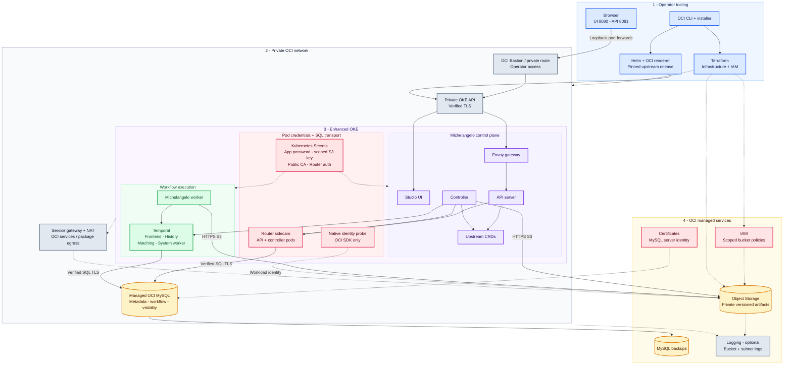

# Architecture

This repository wraps the upstream Michelangelo chart. It does not fork or replace the platform. The development architecture is a small, private OCI deployment; production deployments require separate qualification.

**Colors:** blue - operator tooling; purple - control plane; green - workflows; amber - data; rose - credentials and identity; slate - networking and optional observability.

The dashed native identity path belongs to the ephemeral OCI SDK diagnostic. It is separate from upstream S3 authentication. Object Storage and other regional OCI services sit outside the VCN; service-gateway/IAM controls govern their access. Upstream S3 clients do not automatically use this identity. The initial artifact path requires a dedicated customer secret key and bucket-scoped IAM policy.

## Components and data flow

The browser downloads Studio from the UI forward on 8080 and calls the separate
Envoy forward on 8081. Envoy translates browser/JSON requests to the API server.
API/controller use Kubernetes CRDs and metadata storage; the controller starts
Temporal workflows, and Michelangelo workers poll Temporal for work. Temporal's
history, matching and system-worker services provide workflow orchestration,
with separate persistence/visibility schemas in managed MySQL.

The controller fetches UniFlow archives and the tested worker storage activity
reads datasets from Object Storage over HTTPS. The example harness subsequently
writes the returned result and registers model metadata through the API.
Database schema initialization and Temporal namespace registration use short-lived
Jobs; the database bootstrap Job temporarily holds administrator credentials and
removes them afterward. Normal workloads reference application Secrets only.

OKE uses private API/worker subnets, a database subnet, an optional Bastion subnet
and a reserved private load-balancer subnet. No load balancer is created in this
MVP. NSGs bound network access; the service gateway routes OCI service traffic,
while NAT supports external image/package downloads. A flannel overlay does not
supply application network isolation. See [infrastructure](infrastructure.md).

Certificates and the service identity/key are prepared outside Terraform. IAM
policies, cluster/network/database/bucket and optional logs are Terraform-managed;
Helm plus the post-renderer owns the platform. [Deployment](deployment.md) and
[access](access.md) describe the operator sequence.

## Integration boundaries

| Layer | OCI choice | Integration boundary |
| --- | --- | --- |
| Kubernetes | OKE | Upstream chart and CRDs; pin chart source and images |
| Metadata | OCI MySQL | Upstream Go MySQL backend; preserve SQL schema |
| Database transport | MySQL Router sidecar | Localhost plaintext inside the pod, verified TLS across the network |
| Workflows | Temporal | Separate persistence and visibility databases; supported TLS configuration |
| Models and artifacts | OCI Object Storage | S3 compatibility endpoint over HTTPS |
| Native API identity | OKE workload identity | OCI SDK clients only; enhanced cluster required |
| Observability | OCI Logging and Kubernetes logs | Enabling Object Storage service logs does not enable all pod logging |
| Administrative access | Private endpoint and Bastion/VPN | No public platform ingress by default |

## Why there is no Ansible layer yet

Terraform manages OCI infrastructure and Helm manages Kubernetes resources. An additional configuration system is unnecessary until a host-level operation cannot be expressed cleanly by those tools. The installer should have one configuration source and deterministic commands.

## Sources

- [Michelangelo overview](https://michelangelo-ai.org/docs/getting-started/overview/)
- [OKE workload identity](https://docs.oracle.com/en-us/iaas/Content/ContEng/Tasks/contenggrantingworkloadaccesstoresources.htm)
- [OCI S3 customer secret keys](https://docs.oracle.com/en-us/iaas/Content/Identity/access/working-with-customer-secret-keys.htm)
- [MySQL Router TLS settings](https://dev.mysql.com/doc/mysql-router/8.4/en/mysql-router-conf-options.html)
